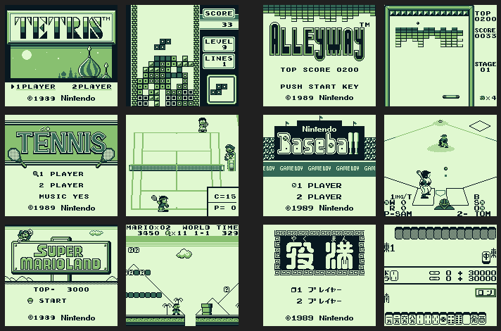
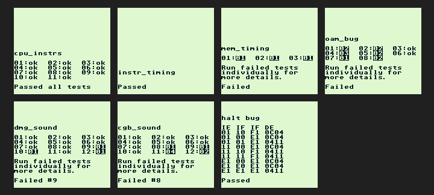

# xFF - Experimental Emulator embedded in Unity3D

## Core Status ##
## [GB Emulation Status](GB_Status.md) ##
Game Boy core emulation. Initially, only the classic emulation will be supported.  
### Features
- Audio support
- Support for ROMs with mapper MBC1
- Save support
- Includes a custom bootROM with quick intro animation \([source code](https://github.com/fattard/xFF/blob/master/CutomBootROM/DMG/DMG_CustomBootRom.asm)\)   
- Customizable screen color and display zoom size (currently only by editing config file)   

Remember to check the [status page](GB_Status.md) for information on what is supported or not.
 
 
Below is a montage of all 6 Launch Titles running:
 

 
 
Below is the current montage of results from Blargg's tests:

 
The mem_timing test fails, as it requires cycle accurate emulation. It will take some time for this.    
DMG sound tests failed are 09, 10 and 12, all related to edge cases for accessing Wave pattern memory while Channel3 is On, that should not affect most games.
The OAM hardware bug tests also fails, as this kind of behaviour is not being emulated.
 
 
Check more accuracy test results: [GB Test Results](https://github.com/fattard/xFF/blob/master/GB_TestResults.md) page.
 
### Joypad Controls ###
Supports both Keyboard control and Xbox Controller (compatible with any XInput device).  
The controls uses pre-mapped keys for now:

GB Button | Keyboard | Xbox Controller
----------|----------|----------------
Button A | X | B
Button B | Z | A
Button Select | Right Shift | Back
Button Start | Enter/Return | Start
DPad Up | Arrow Up | DPad Up / Left Stick Up
DPad Down | Arrow Down | DPad Down / Left Stick Down
DPad Left | Arrow Left | DPad Left / Left Stick Left
DPad Right | Arrow Right | DPad Right / Left Stick Right
 

 
 

## [BytePusher Emulation Status](BytePusher_Status.md) ##
Special test core based on OISC ByteByteJump Processor.  
It supports full graphics, keyboard and sound.  
I think the sound is not stuttering anymore, would appreciate feedback.  
It's my first time coding procedural audio.
 
 
Below is a montage of 4 programs running:

All known programs can be downloaded from [BytePusher home](https://esolangs.org/wiki/BytePusher#Programs).  
The keyboard emulation uses the real keyboard keys ('0'-'9', 'A'-'F')
