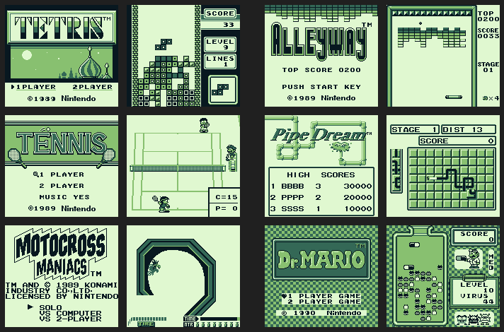

# xFF - Experimental Emulator embedded in Unity3D

## Core Status ##
## [GB Emulation Status](GB_Status.md) ##
Game Boy core emulation. Initially, only the classic emulation will be supported.  
The current release build (v0.0.4) is able to run TestROMS, such as [Blargg\'s individual cpu\_intrs](http://gbdev.gg8.se/files/roms/blargg-gb-tests/), and also some [mooneye-gb tests](https://gekkio.fi/files/mooneye-gb/latest/), and also commercial games that do not use mappers (such as MBC1 or MBC3, aka. "ROM ONLY" 32KB files).  
Remember to check the [status page](GB_Status.md) for information on what is supported or not.
 
 
Below is a montage of 3 games running:
 

 
 
Below is the current montage of results from cpu_instrs individual tests:

 
Instruction 'DAA' is stubbed for now, and I think I can blame my bad Half-Borrow  
implementation to cause many of the tests to fail.
 
 
### Keyboard Controls ###
GB Button | Keyboard
----------|---------
Button A | X
Button B | Z
Button Select | Right Shift
Button Start | Enter/Return
DPad Up | Arrow Up
DPad Down | Arrow Down
DPad Left | Arrow Left
DPad Right | Arrow Right
 

 
 

## [BytePusher Emulation Status](BytePusher_Status.md) ##
Special test core based on OISC ByteByteJump Processor.  
It supports full graphics, keyboard and sound.  
Sound might be stuttering, it's my first time coding procedural audio.
 
 
Below is a montage of 4 programs running:

All known programs can be downloaded from [BytePusher home](https://esolangs.org/wiki/BytePusher#Programs).  
The keyboard emulation uses the real keyboard keys ('0'-'9', 'A'-'F')
