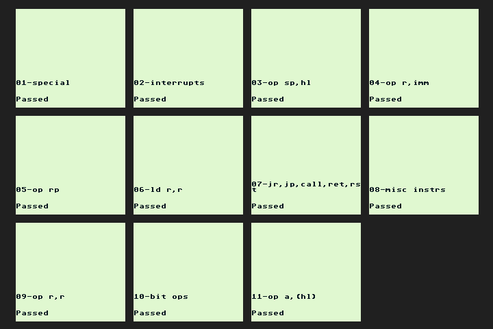

# xFF - Experimental Emulator embedded in Unity3D

## Core Status ##
## [GB Emulation Status](GB_Status.md) ##
Game Boy core emulation. Initially, only the classic emulation will be supported.  
The current release build (v0.0.5) is able to run TestROMS, such as [Blargg's individual cpu\_intrs](http://gbdev.gg8.se/files/roms/blargg-gb-tests/), some
[mooneye-gb tests](https://gekkio.fi/files/mooneye-gb/latest/), and also commercial games that do not use mappers (such as MBC1 or MBC3).  
Those supported ROMs are also known as "ROM ONLY" 32KB files.  
Remember to check the [status page](GB_Status.md) for information on what is supported or not.
 
 
Below is a montage of 6 games running:
 

 
 
Below is the current montage of results from cpu_instrs individual tests:

 
The instructions timing is not properly tested yet, as there are still some
tweaks in the Timer Controller to allow proper sync to run the tests.
 
 
### Joypad Controls ###
Supports both Keyboard control and Xbox Controller (compatible with any XInput device).  
The controls uses pre-mapped keys for now:

GB Button | Keyboard | Xbox Controller
----------|----------|----------------
Button A | X | B
Button B | Z | A
Button Select | Right Shift | Back
Button Start | Enter/Return | Start
DPad Up | Arrow Up | DPad Up / Left Stick Up
DPad Down | Arrow Down | DPad Down / Left Stick Down
DPad Left | Arrow Left | DPad Left / Left Stick Left
DPad Right | Arrow Right | DPad Right / Left Stick Right
 

 
 

## [BytePusher Emulation Status](BytePusher_Status.md) ##
Special test core based on OISC ByteByteJump Processor.  
It supports full graphics, keyboard and sound.  
I think the sound is not stuttering anymore, would appreciate feedback.  
It's my first time coding procedural audio.
 
 
Below is a montage of 4 programs running:

All known programs can be downloaded from [BytePusher home](https://esolangs.org/wiki/BytePusher#Programs).  
The keyboard emulation uses the real keyboard keys ('0'-'9', 'A'-'F')
